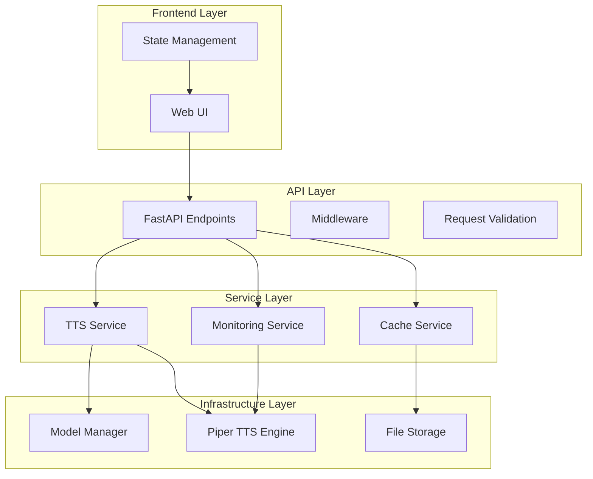
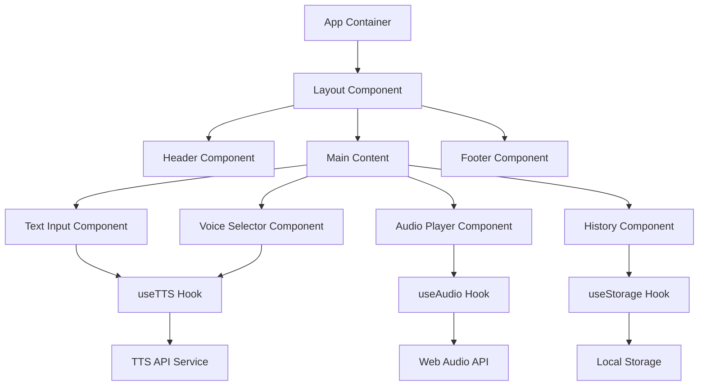

# Design Document: TTS Server Enhancements

## Overview

This design document outlines the technical approach for enhancing the Piper TTS Server with comprehensive documentation, a user-friendly frontend, improved application stability, and a proposal for future enhancements. The design builds upon the existing FastAPI-based backend and introduces new components to fulfill the requirements.

## Architecture

The enhanced TTS system will follow a layered architecture with clear separation of concerns:



### Key Components:

1. **Frontend Layer**: New React-based web interface
2. **API Layer**: Existing FastAPI endpoints with enhanced validation and error handling
3. **Service Layer**: Core business logic for TTS processing and caching
4. **Infrastructure Layer**: Integration with Piper TTS engine and model management

## Components and Interfaces

### 1. Documentation System

The documentation will be implemented as a combination of:

1. **API Documentation**: Enhanced OpenAPI/Swagger documentation
2. **Static Documentation Site**: Using MkDocs with Material theme
3. **In-code Documentation**: Comprehensive docstrings and comments

#### Documentation Structure:

```
docs/
├── index.md                  # Overview and introduction
├── installation/             # Installation guides
│   ├── quickstart.md         # Quick start guide
│   ├── docker.md             # Docker installation
│   └── manual.md             # Manual installation
├── configuration/            # Configuration reference
│   ├── server.md             # Server configuration
│   ├── models.md             # Model configuration
│   └── security.md           # Security settings
├── api/                      # API documentation
│   ├── endpoints.md          # Endpoint reference
│   └── examples.md           # Usage examples
├── frontend/                 # Frontend documentation
│   ├── usage.md              # User guide
│   └── customization.md      # Customization options
├── development/              # Developer documentation
│   ├── architecture.md       # System architecture
│   ├── contributing.md       # Contribution guidelines
│   └── testing.md            # Testing guidelines
└── troubleshooting.md        # Troubleshooting guide
```

### 2. Frontend System

The frontend will be implemented as a single-page application (SPA) using React with TypeScript, following the design proposed in the existing frontend_proposal.md.

#### Key Frontend Components:

1. **TextInput**: Multi-line editor for entering text to synthesize
2. **VoiceSelector**: Dropdown component for selecting models and speakers
3. **AudioPlayer**: Waveform visualization and playback controls
4. **History**: Component for displaying and managing generation history

#### Frontend Architecture:



### 3. Stability Enhancements

The stability improvements will focus on:

1. **Resource Management**: Enhanced concurrency control and resource allocation
2. **Error Handling**: Comprehensive error handling and graceful degradation
3. **Monitoring**: Health checks and performance metrics
4. **Validation**: Improved input validation and model verification

#### Stability Components:

1. **Enhanced Semaphore System**: Improved concurrency control for TTS requests
2. **Model Validation Service**: Verification of model integrity on startup
3. **Health Check System**: Expanded health check endpoints with detailed status
4. **Memory Management**: Optimized cache management and resource cleanup

## Data Models

### Frontend State Model

```typescript
interface AppState {
  // Text input state
  text: string;
  
  // Voice selection state
  selectedModel: string;
  selectedSpeaker: string;
  availableModels: Model[];
  
  // Audio state
  audioBlob: Blob | null;
  isPlaying: boolean;
  isGenerating: boolean;
  
  // History state
  history: HistoryItem[];
}

interface Model {
  id: string;
  speakers: Speaker[];
  hasModelCard: boolean;
  hasDemo: boolean;
}

interface Speaker {
  id: string;
  name: string;
}

interface HistoryItem {
  id: string;
  text: string;
  model: string;
  speaker: string;
  timestamp: number;
  audioUrl: string;
}
```

### Enhanced Server Models

```python
class EnhancedTTSRequest(BaseModel):
    text: str
    model: str = settings.default_model
    speaker_id: str = settings.default_speaker
    output_format: str = "wav"  # New field for output format
    
    # Enhanced validation with more detailed error messages
    
class ServerStatus(BaseModel):
    status: str
    version: str
    uptime: float
    models_available: int
    models_loaded: int
    current_requests: int
    max_concurrent_requests: int
    cache_size: int
    cache_hits: int
    cache_misses: int
```

## Error Handling

The enhanced system will implement a comprehensive error handling strategy:

1. **Hierarchical Error Types**:
   - `TTSBaseError`: Base class for all TTS-related errors
   - `ModelError`: Errors related to TTS models
   - `RequestError`: Errors in request processing
   - `SystemError`: Internal system errors

2. **Error Response Format**:
```json
{
  "error": {
    "code": "ERROR_CODE",
    "message": "Human-readable error message",
    "details": {
      "param": "Additional error context"
    },
    "help_url": "https://docs.example.com/errors/ERROR_CODE"
  }
}
```

3. **Error Logging Strategy**:
   - Development: Detailed error logs with stack traces
   - Production: Sanitized logs with error codes and essential context
   - Critical errors trigger alerts via configured channels

## Testing Strategy

The testing strategy will cover all components of the system:

1. **Unit Tests**:
   - Backend: Pytest for individual components and functions
   - Frontend: Jest for React components and hooks

2. **Integration Tests**:
   - API endpoint tests with realistic request flows
   - Frontend-backend integration tests

3. **End-to-End Tests**:
   - Cypress for testing the complete user journey
   - Performance tests for stability under load

4. **Test Coverage Targets**:
   - Backend: 80% code coverage
   - Frontend: 70% code coverage
   - Critical paths: 100% coverage

## Implementation Considerations

### Documentation Implementation

1. **API Documentation**:
   - Enhance FastAPI's automatic OpenAPI documentation
   - Add detailed examples and descriptions to all endpoints
   - Include authentication and error handling documentation

2. **Static Documentation**:
   - Use MkDocs with Material theme
   - Implement search functionality
   - Include code examples for common use cases
   - Add diagrams for architecture and workflows

### Frontend Implementation

1. **Build System**:
   - Use Vite for fast development and optimized production builds
   - Configure TypeScript for type safety
   - Set up ESLint and Prettier for code quality

2. **Component Structure**:
   - Create reusable UI components
   - Implement responsive design with Tailwind CSS
   - Use Headless UI for accessible components

3. **State Management**:
   - Use Zustand for global state management
   - Implement React Query for API data fetching and caching
   - Use local storage for history persistence

### Stability Implementation

1. **Resource Management**:
   - Implement adaptive concurrency limits based on system load
   - Add timeouts to prevent long-running requests
   - Implement graceful shutdown procedures

2. **Monitoring**:
   - Add Prometheus metrics for system performance
   - Implement structured logging with correlation IDs
   - Create dashboard templates for monitoring

3. **Error Handling**:
   - Enhance error middleware to provide consistent error responses
   - Implement retry mechanisms for transient failures
   - Add circuit breakers for external dependencies

## Future Enhancement Proposal Structure

The future enhancement proposal will be structured as follows:

1. **Executive Summary**: Brief overview of proposed enhancements
2. **Enhancement Categories**:
   - Performance improvements
   - Feature additions
   - User experience enhancements
   - Security improvements
3. **Prioritized Roadmap**: Timeline and milestones
4. **Technical Approaches**: High-level implementation strategies
5. **Resource Requirements**: Estimated effort and dependencies