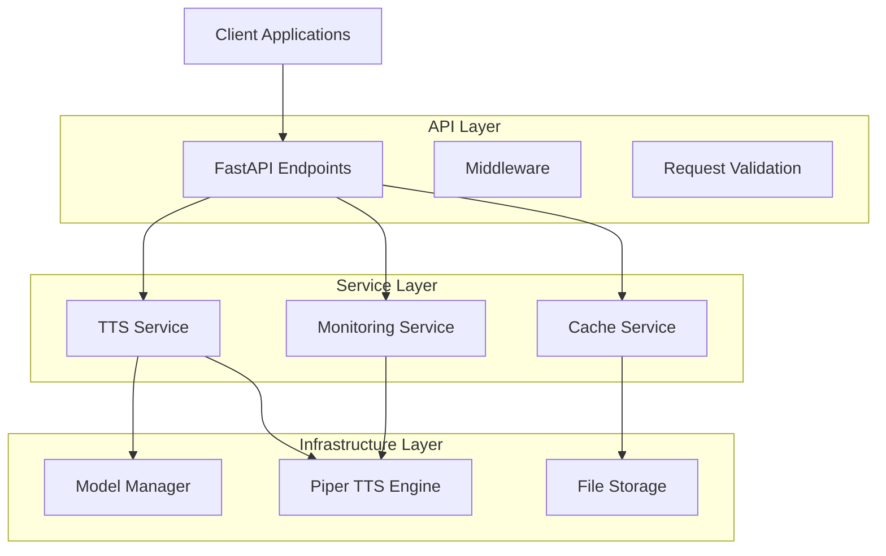
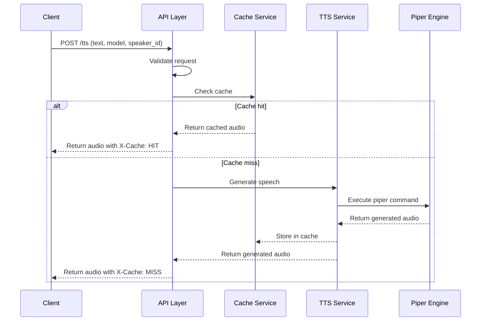
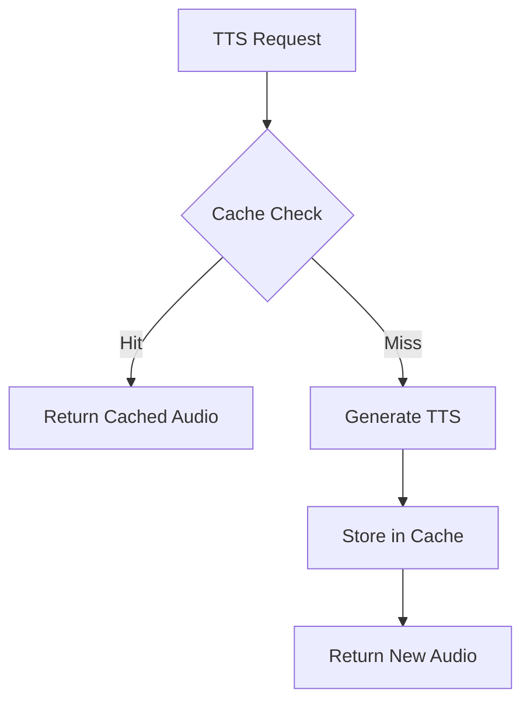

# System Architecture

This document provides an overview of the Piper TTS Server architecture and its components.

## High-Level Architecture

The Piper TTS Server follows a layered architecture with clear separation of concerns:



## Core Components

### API Layer

The API layer is built with FastAPI and provides the following endpoints:

- **Health Check**: `/health` - Provides server status information
- **Service Info**: `/info` - Provides information about the service and available models
- **Voices**: `/voices` - Lists all available voice models and their speakers
- **Model Card**: `/model_card/{model}` - Provides documentation for a specific model
- **Demo Audio**: `/demo/{model}/raw` - Provides a demo audio file for a specific model
- **TTS Generation**: `/tts` - Generates speech from text using the specified model and speaker

The API layer also includes middleware for:
- CORS (Cross-Origin Resource Sharing)
- Rate limiting
- Error handling

### Service Layer

The service layer contains the core business logic:

- **TTS Service**: Handles text-to-speech conversion using the Piper engine
- **Cache Service**: Manages caching of generated audio to improve performance
- **Monitoring Service**: Provides health checks and performance metrics

### Infrastructure Layer

The infrastructure layer interacts with external systems and resources:

- **Model Manager**: Loads and manages TTS models
- **Piper Engine**: Interfaces with the Piper TTS engine
- **File Storage**: Manages audio files and model files

## Data Flow

The following diagram illustrates the data flow for a typical TTS request:



## Concurrency Control

The server uses a semaphore to limit the number of concurrent TTS requests:

```python
# Semaphore to limit concurrent TTS requests
tts_semaphore = asyncio.Semaphore(settings.max_concurrent_requests)
```

This prevents resource exhaustion when the server is under heavy load.

## Caching Mechanism

The server implements an in-memory cache for TTS responses:



The cache uses a combination of text, model, and speaker ID as the cache key, and includes TTL (Time To Live) functionality to expire old entries.

## Configuration Management

The server uses Pydantic's `BaseSettings` for configuration management, which allows loading settings from environment variables or a `.env` file:

```python
class Settings(BaseSettings):
    # Server settings
    host: str = "0.0.0.0"
    port: int = 5000
    debug: bool = False
    
    # TTS settings
    model_dir: str = "models"
    max_text_length: int = 500
    default_model: str = "en_GB-vctk-medium"
    default_speaker: str = "0"
    
    # Security settings
    enable_cors: bool = True
    allowed_origins: list = ["*"]
    rate_limit_requests: int = 60
    rate_limit_window: int = 60
    
    # Performance settings
    max_concurrent_requests: int = 10
    enable_caching: bool = True
    cache_ttl: int = 3600
    
    class Config:
        env_file = ".env"
        env_file_encoding = "utf-8"
```

## Security Considerations

The server implements several security measures:

1. **Input Validation**: All request parameters are validated using Pydantic models
2. **Path Traversal Prevention**: Model names are sanitized to prevent path traversal attacks
3. **Rate Limiting**: All endpoints are rate-limited to prevent abuse
4. **CORS Configuration**: CORS can be enabled or disabled as needed